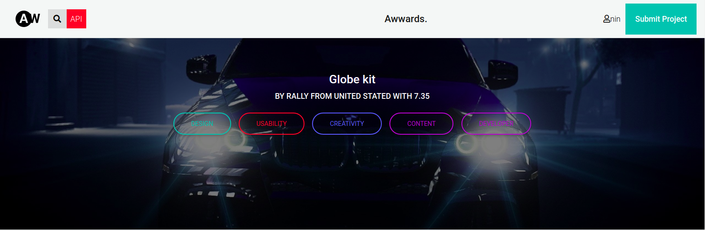

# INSTAGRAM CLONE

## By BrysonMundia (https://github.com/Bryson69)😎 

## Live Site [Instagram Clone](https://instaclone345.herokuapp.com/) 

## Description

A web application whereby you can view projects or pitched ideas by other people. Auser can also vote on a project.

### Here is a sneak peek of How it looks

## User Stories

* View posted projects and their details
* Post a project to be rated/reviewed
* Rate/ review other users' projects
* Search for projects 
* View projects overall score
* View my profile page

## Prerequisites
* Python3.6

## Setup/Installation Requirements
* internet access
* $ git clone https://github.com/Bryson69/Instagram-Clone
* $ cd blog-app
* $ python3.6 -m venv virtual (install virtual environment)
* $ source virtual/bin/activate
* $ python3.6 -m pip install -r requirements.txt (install all dependencies)
* $ python3 run.py

# How it works
> User needs to sign up.
> A User the needs to sign in to the awwwards account and post a project

# CREDITS
##### Google.com ⭐️ StackOverflow.com ⭐️ & :star:.

# Support and Contacts
In case You have any issues using this code please do no hesitate to get in touch with me through brysonmundia@gmail.com or leave a comment here on Github.

## Known Bugs
Change the user login does not function properly.

## Technologies Used
- Python3.6
- Django framework
- Bootstrap
- PostgreSQL

## :computer: Installation
Get the real application on snapstore.
Available for Windows, macOS, and Linux.

> For linux users. You can directly install it from SnapStore.

### License
**[MIT](./LICENSE)** (c) 2020 **[Bryson Mundia]()**