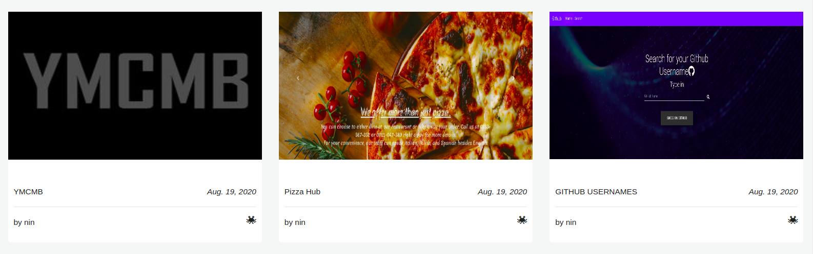
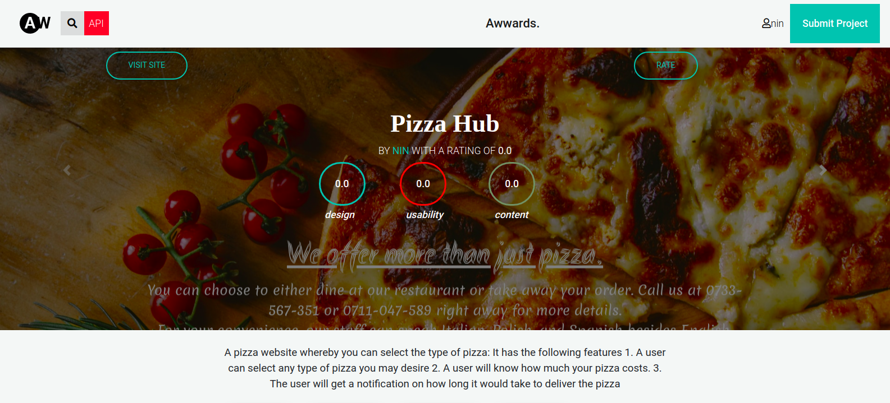
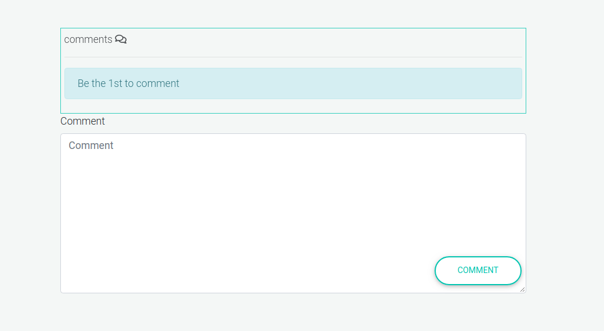

# Awwwards Clone

## By BrysonMundia (https://github.com/Bryson69)😎 

## Live Site [Awwwards]() 

## Description

A web application whereby you can view projects or pitched ideas by other people. A user can also vote on a project.

### Here is a sneak peek on how it looks...




### How It looks when a user is logged in





## User Stories

* View posted projects and their details
* Post a project to be rated/reviewed
* Rate/ review other users' projects
* Search for projects 
* View projects overall score
* View my profile page


## Prerequisites
* Python3.6

## Setup and installations
* Fork the data onto your own personal repository.
* Clone Project to your machine
* Activate a virtual environment on terminal: `source virtual/bin/activate`
* Install all the requirements found in requirements file. ```bash pip install -r requirements.txt```
* Then ```bash python manage.py makemigrations``` ```bash python manage.py migrate```
* On your terminal run `python3.6 manage.py runserver`
* Access the live site using the local host provided


#### Clone the Repo and rename it to suit your needs.
```bash
git clone
```
#### Initialize git and add the remote repository
```bash
git init
```
```bash
git remote add origin <your-repository-url>
```

#### Create and activate the virtual environment
```bash
python3.6 -m virtualenv virtual
```

```bash
source virtual/bin/activate
```

#### Setting up environment variables
Create a `.env` file and paste paste the following filling where appropriate:
```
SECRET_KEY='rdtfyguihjohucbdsjnc'
DEBUG=True
DB_NAME='tribune'
DB_USER='<your database name>'
DB_PASSWORD='<password to your database>'
DB_HOST='127.0.0.1'
MODE='dev'
ALLOWED_HOSTS='.localhost', '.herokuapp.com', '.127.0.0.1'
DISABLE_COLLECTSTATIC=1
```

#### Install dependancies
Install dependancies that will create an environment for the app to run
`pip install -r requirements.txt`

#### Make and run migrations
```bash
python3.6 manage.py check
python manage.py makemigrations news
python3.6 manage.py sqlmigrate news 0001
python3.6 manage.py migrate
```

#### Run the app
```bash
python3.6 manage.py runserver
```
Open [localhost:8000](http://127.0.0.1:8000/)

# How it works
* User needs to sign up.
* A User the needs to sign in to the awwwards account and post a project

# CREDITS
##### Google.com ⭐️ StackOverflow.com ⭐️ &  Awwwards:star:.

# Support and Contacts
In case You have any issues using this code please do no hesitate to get in touch with me through brysonmundia@gmail.com or leave a comment here on Github.

## Known Bugs
None so far.

## Technologies Used
- Python3.6
- Django framework
- Bootstrap
- PostgreSQl


### License
**[MIT](./LICENSE)** (c) 2020 **[Bryson Mundia]()**
